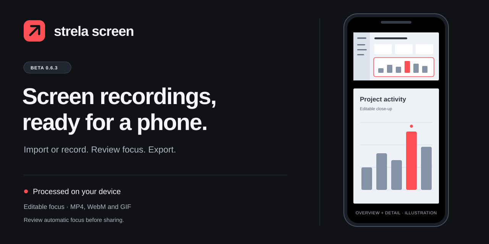

# Strela Screen

**Turn desktop recordings into phone-ready demos.** Import a video, let Strela find visual areas of attention, and download a styled MP4. Processing stays on your device.

[Download 0.5.0 beta](https://github.com/senamh/strela-screen/releases/tag/v0.5.0) · [Русская инструкция](INSTALL_RU.md) · [Report an issue](https://github.com/senamh/strela-screen/issues)

> Free public beta. Not a signed desktop app or store-listed extension. The local studio has been checked in Chrome on macOS; Windows/Edge and the installed extension still need qualification.

## From desktop to phone

- **Import → analyse → render.** Video imports automatically receive editable focus points, black phone framing and MP4 export. The finished video downloads on its own as `<project> - Strela.mp4`.
- **Keep the context.** A full-frame overview remains above the detailed view. When analysis finds no reliable focus, the complete source is preserved without an invented crop.
- **A camera that follows the story.** The frame arrives just before each action, stays on it afterwards, pans straight to the next nearby action instead of zooming out and back in, and zooms closer on small controls than on large panels. While it holds, it follows the work when it drifts towards the edge of the frame.
- **Skip the waiting.** Optionally play pauses where nothing on screen changes up to 16× faster, without touching your edit.
- **Make it yours.** Smooth camera motion, five backgrounds including true black, four canvas layouts, editable focus and a non-destructive timeline.
- **Keep it local.** No Strela account or upload service. Autosave in your browser and portable .strela project backups.
- **Record or import.** Screen/window/tab capture, pause/resume and optional audio. Export MP4, WebM or short GIFs, with a Best, Balanced or Small file size. No added click waves or synthetic click sounds.

## Install in Chrome or Edge

1. Download **strela-screen-0.5.0.zip** from the [release assets](https://github.com/senamh/strela-screen/releases/tag/v0.5.0) and extract it.
2. Open chrome://extensions or edge://extensions, enable Developer mode and choose **Load unpacked**.
3. Select the extracted **strela-screen** folder containing manifest.json.
4. Open the extension → **Open studio** → **Import** a video or **Try a demo**.
5. Wait for analysis and rendering; the MP4 downloads when it is ready. **Save project** creates a `.strela` backup, not a video.

For recording, use **Record**. Existing .strela files restore your saved edits rather than reprocessing them. Before updating, save project backups and reload the extension from its existing folder; uninstalling can erase its library.

## What automatic analysis does — and does not do

Strela uses conservative frame differences to find dominant local changes. It does **not** understand text, infer semantic importance or guarantee cursor recognition. Scrolls, scene cuts and scattered changes are generally rejected. Review generated focus before sharing.

Imported videos default to a black 1206×2622 phone layout and MP4 at 50 fps for 25/50 fps sources or 60 fps otherwise, at the Balanced file size, about half the size of Best with the same text sharpness in our checks. Detail comes from the source, not the output dimensions: record at 1440p/4K with readable UI text when possible. Upscaling cannot recover missing detail. See [mobile guidance](MOBILE.md).

## Build and test

~~~sh
npm ci
npm run build
npm test
npm run dev
npm run package   # release ZIP and Chrome Web Store ZIP in outputs/
~~~

Open http://127.0.0.1:4173 for the local studio. Load **dist/strela-screen** for the extension. Localhost and the extension keep separate project libraries. Chrome 116 is the declared API minimum; use a current Chrome/Edge release. Safari and Firefox are unsupported.

**32 automated tests pass.** Import → analysis → MP4 was also checked on synthetic fixtures and a real 8-minute screen recording. This is not cross-platform or physical-iPhone certification. [QA evidence](QA.md) · [Release notes](RELEASE_NOTES.md)

## Components and source

| Component | Role | Version |
|---|---|---|
| Mediabunny | Media decoding, encoding and MP4/WebM containers | 1.56.1 |
| fflate | Portable project archives | 0.8.3 |
| gifenc | GIF encoding | 1.0.3 |
| esbuild | Build tooling | 0.28.2 |

See [third-party notices](THIRD_PARTY_NOTICES.md) for licenses and source locations. Strela's UI, camera, timeline and visual-change analysis are original project code. No Screen Studio, OpenScreen or other app code/assets are claimed as reused. Public repository access is not a new license grant for the original project code; third-party components retain their own licenses.

## Beta boundaries

- Installed-extension permissions, Windows/Edge, long recordings, 4K performance and forced-crash recovery need further testing.
- System audio depends on browser, OS and selected source. Large exports use memory.
- No native companion or reconstructed global cursor; no webcam track, captions, native installers or automatic updates.
- Keep the studio open during processing. Save .strela backups before clearing browser data or removing the extension.

[Privacy policy](PRIVACY.md) · [Production release checklist](RELEASE_CHECKLIST.md). Report bugs with a non-sensitive reproduction; never upload private recordings to public issues.
